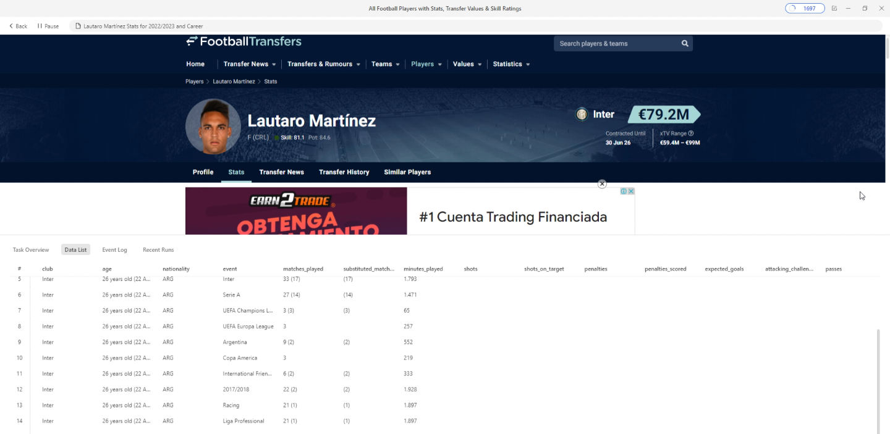
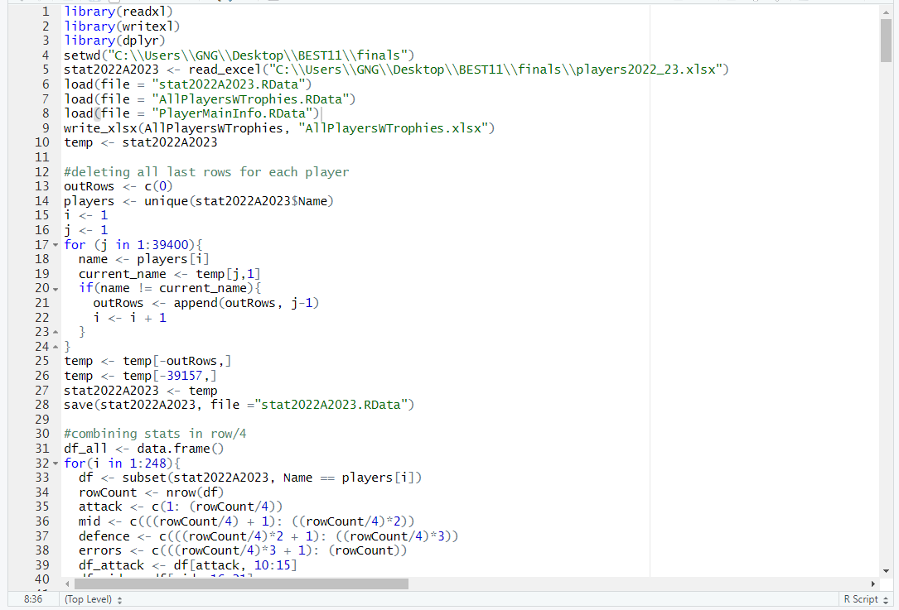
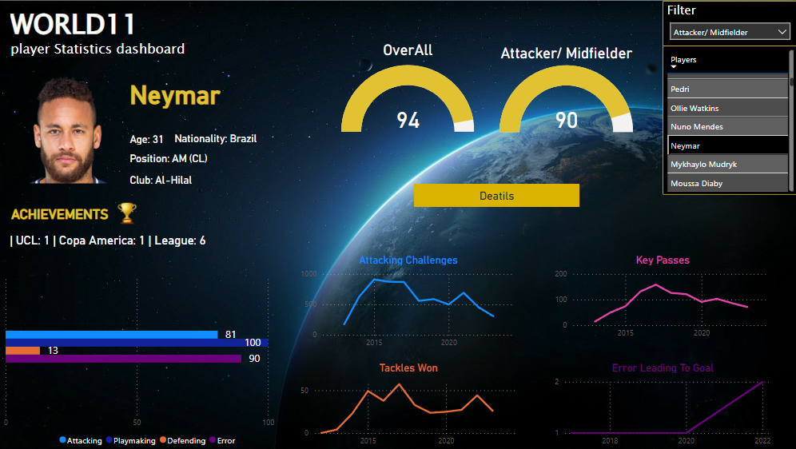

# Football Players Analysis

## Table of contents 📋
1. [Introduction](https://github.com/masudsajid/Football-Player-Analysis-Dashboard#introduction)
2. [Problem statement](https://github.com/masudsajid/Football-Player-Analysis-Dashboard#problem-statement)
4. [Skills/ concepts used](https://github.com/masudsajid/Football-Player-Analysis-Dashboard#skills-concepts-used)
5. [Data extraction](https://github.com/masudsajid/Football-Player-Analysis-Dashboard#data-extraction)
6. [Data transformation in RStudio](https://github.com/masudsajid/Football-Player-Analysis-Dashboard?tab=readme-ov-file#data-transformation-in-rstudio)
7. [Power BI dashboard](https://github.com/masudsajid/Football-Player-Analysis-Dashboard?tab=readme-ov-file#power-bi-dashboard)

## Introduction
I was assigned to compile the data for 200+ football players and present the anaysis in the form of an interactive dashboard. For this purpose, I extracted
over 48,000 rows of data from _footballtransfers.com_. The raw data was then cleaned in RStudio to transfer them into valuable insights. Next step was to visualise
these insights. I then made a power BI dashboard, which would assist the selection committe to make the right decisions.

## Problem statement
Aliens have threatened to take our planet. We must defeat them in a football match to defend the Earth. If we win, we can keep our planet and the aliens will assist us in technological advancements. But if we lose, not only our planet would be destroyed but all the humans would be made slaves on the Alien’s planet.
We need to select our best 11 with 4 substitutes under the guidance of THE best coach on the planet.

_Our formation would be of 1-4-3-2-1_.

### Criteria for selection
**Note:** _This criteria may not be realistic. It is selected in such a way that encorporates as many testing points as possible_. 
### Goalkeeper:
1.	20-30 years of age
2.	Most defending challenges won with least errors
3.	Must have won a league or major title

### Defender:
1.	20-30 years of age
2.	Most defending challenges won with least errors
3.	Must have won a league or major title

### Midfielder:
1.	20-30 years of age
2.	Most key passes
3.	Must have won a league or major title

### Attacker:
1.	20-30 years of age
2.	Most attacking challenges
3.	Must have won a league or major title
   
### Winger:
1.	20-30 years of age
2.	Most key passes and attacking challenges
3.	Must have won a league or major title

**The team must represent players from all continents**

## Skills/ concepts used

- Web scraping
- Power bi dashboard
- Data cleaning in RStudio
- Data integration
- Typecasting
- Data collection
- Data accuracy
- Data integrity
- Data transformation
- Data standardization

## Data extraction

For this purpose, I used a software called octoparse 8. It is a very easy to use software for parsing data on the web. You simply make a flow chart of actions, and it detects data on runtime. I wanted to source my data in such a way that it is not already ranked based on the skillset of players, to make it more challenging. I sourced my data from _TransfetMarket_. As the market value is directly linked with a player’s performance, I picked the data of the top 250 players. Players were of all positions and all statistics were collected in the fields of attacking, defending, creativity and error
- **Data Processing and Formats:**
  - Split the process into 5 parts, scraping data from 2 pages each.
  - Saved data in two formats: XLSX and JSON for versatility.
  - Ensured compatibility across different platforms.
- **Player Count Verification:**
  - Each page had 25 players (except pages 3 and 4).
  - Total players: 25 × 8 + 24 × 2 = 248.
  - Filtered stats for the 2022/2023 season.
  - Noticed a discrepancy: 988 rows (divided by 4 = 247 players).
  - Identified a missing player during extraction.
- **Data Recheck and Accuracy:**
  - Reviewed all 5 Excel files.
  - Found a missing player in File 4.
  - Scraped data for pages 7 and 8 again.
  - Verified accurate data in the second run.
  - Total data gathered: 248 players.

## Data transformation in RStudio

After the data is gathered, it is now time to make it analyzable. For this purpose, the data frame is exported to RStudio. The data is gathered in blocks, meaning for all players, 4 blocks were made in which data for attacking, playmaking, defending and error was scraped. Following are the steps taken in the [R script](https://github.com/masudsajid/Football-Player-Analysis-Dashboard/blob/main/RScript.R):

**Data Loading:**
- Loaded data from various Excel files (WorldCupWinnersExcel.xlsx, UEFA Champions League Winners List Excel.xlsx, etc.).
- Each file contains information about trophy winners in different football tournaments.

**Data Transformation:**
- Checked if any other string in the event column contains a slash (“/”).
- Created a new column (mixCol) to match the columns in the trophies file.

**Season Handling:**
- Set the default season to “2022/2023”.
- For each row, checked if the event column contains a slash. If yes, updated the season, otherwise combined the default season with the existing event description.

**Trophy Data Integration:**
- Created new columns (WC, UCL, Europa, Euro, Copa America, and League) in the AllPlayersWTrophies data frame.
- Checked if each player’s season matches the trophy-winning seasons in various tournaments (e.g., World Cup, UEFA Champions League, etc.).
- Marked players with “Yes” in the corresponding columns if they won specific trophies.

**Data Cleaning:**
- Manually inspected the data to verify trophy information.
- Identified discrepancies (e.g., players like Antonio Rüdiger showing up as World Cup winners but not part of the squad).
- Corrected the data by removing incorrect entries (e.g., setting Rüdiger’s World Cup status to empty).

**Player Images Extraction:**
- Extracted unique player names from the AllPlayersWTrophies data.
- Created a data frame (playerNames) to store player names and image URLs.
- Loaded player images from Excel files (playersImages.xlsx and playersImages2.xlsx).
- Matched player names with their corresponding images and updated the playerNames data frame.
- Saved the final player names and image URLs to playerNames.xlsx.

**Player Position Categorization:**
- Created a new table (positions) to categorize players by their positions.
- Extracted unique position values from the AllPlayersWTrophies data.
- Assigned categories (e.g., “Attacker,” “Midfielder,” etc.) based on position prefixes (e.g., “F,” “AM,” etc.).

**Player Category Assignment:**
- Created another data frame (playerCategory) to store player names and their assigned categories.
- Matched player names with their corresponding positions and assigned categories.
- Saved the final player names and categories.

**Player Nationality and Age Data:**
- Created a data frame (playerCategory) to store player names, nationalities, and ages.
- Extracted unique nationality values from the AllPlayersWTrophies data.
- Cleaned the age data by extracting only the first two characters (e.g., “25” from “25 years old”).

**Country and Continent Information:**
- Loaded country data from an external source (e.g., Countries).
- Renamed the column names to match the playerCategory data.
- Merged the player data with country information based on nationality.
- Created a new data frame (playerCategory1) with relevant columns.

**Data Cleaning and Transformation:**
- Processed various player statistics in the AllPlayersWTrophies data frame.
- Removed unnecessary characters (e.g., parentheses) from columns like “matches_played,” “substituted_matches,” “shots,” etc.
- Calculated percentages (e.g., shots on target) based on raw counts.
- Adjusted accurate passes and accurate crosses based on percentage values.

**Data Transformation and Integration:**
- Loaded player data from various sources (e.g., AllPlayersWTrophies.xlsx, playerImages.xlsx, etc.).
- Merged player information with image URLs.
- Created a new data frame (positions) to categorize players by their positions.
- Assigned position categories (e.g., “Attacker,” “Midfielder,” etc.) based on position prefixes (e.g., “F,” “AM,” etc.).

## Power BI dashboard

### Features:
- **Buttons**
- **Cards**
- **Drill through Button**
- **Multi layer slicers**
- **Measures**
   - **Attribute measure**
     - Based on the selected attribute category (e.g., “Attacker,” “Midfielder,” etc.), the code calculates a weighted score.
     - Attributes considered include attacking, playmaking, and defending.
     - The final score represents the player’s overall performance in the specified category.
     

